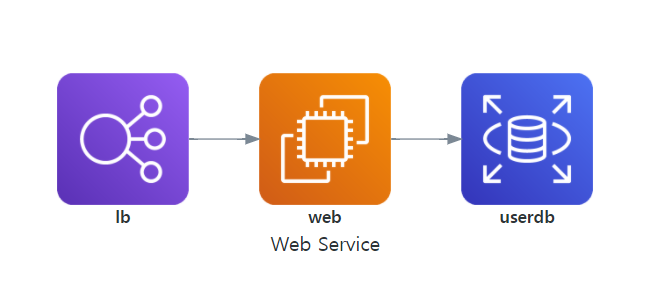
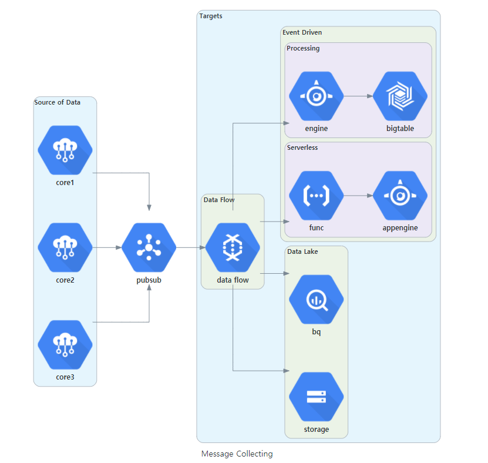

# About Sysgram

**Sysgram draw the system architecture using JavaScript.**

Sysgram was developed inspired by [Diagrams using Python](https://diagrams.mingrammer.com/), thanks to [mingrammer(MinJae Kwon)](https://github.com/mingrammer).

It is a Javascript based diagramming tool that renders text like Markdown definitions to create and modify diagrams dynamically. 


?> Sysgram currently supports six major providers: [`AWS`](nodes/aws), [`Azure`](nodes/azure), [`GCP`](nodes/gcp), [`Kubernetes`](nodes/k8s), [`Alibaba Cloud`](nodes/alibabacloud) and [`Oracle Cloud`](nodes/oci). <br>
It now also supports [`On-Premise`](nodes/onprem) nodes as well as [`Programming Languages`](nodes/programming?id=programminglanguage), [`Frameworks`](nodes/programming?id=programmingframework) and [`Programs`](nodes/program).


# Example

## Simple Diagram

```javascript
var EC2 = diagrams.aws.compute.EC2
var RDS = diagrams.aws.database.RDS
var ELB = diagrams.aws.network.ELB

Diagram("Web Service", function() {
    ELB("lb")._$(EC2("web"))._$(RDS("userdb"))
})
```


## Complex Diagram

```javascript
var { BigQuery, Dataflow, PubSub } = diagrams.gcp.analytics
var {AppEngine, Functions } = diagrams.gcp.compute
var BigTable = diagrams.gcp.database.BigTable
var IotCore = diagrams.gcp.iot.IotCore
var GCS = diagrams.gcp.storage.GCS

Diagram("Message Collecting", () => {
    ctx.pubsub = PubSub("pubsub")
    
    Cluster("Source of Data", () => {
        ArrayNode([IotCore("core1"),
                   IotCore("core2"),
                   IotCore("core3")])._$(ctx.pubsub)
    })

    Cluster("Targets", () => {
        Cluster("Data Flow", () => {
            ctx.flow = Dataflow("data flow")
        })
        
        Cluster("Data Lake", () => {
            ctx.flow._$([BigQuery("bq"),
                         GCS("storage")])
        })

        Cluster("Event Driven", () => {
            Cluster("Processing", () => {
                ctx.flow._$(AppEngine("engine"))._$(BigTable("bigtable"))
            })

            Cluster("Serverless", () => {
                ctx.flow._$(Functions("func"))._$(AppEngine("appengine"))
            })
        })
    })
    ctx.pubsub._$(ctx.flow)
})
```




## Credits

Many thanks to the [d3](http://d3js.org/) and [d3-graphviz](https://github.com/magjac/d3-graphviz) projects for providing the graphical layout and drawing libraries!

Thanks also to the [Diagrams using Python](https://diagrams.mingrammer.com/) project for usage of the python syntax. 

Thanks to [mingrammer(MinJae Kwon)](https://github.com/mingrammer) for inspiration and starting point for developing.